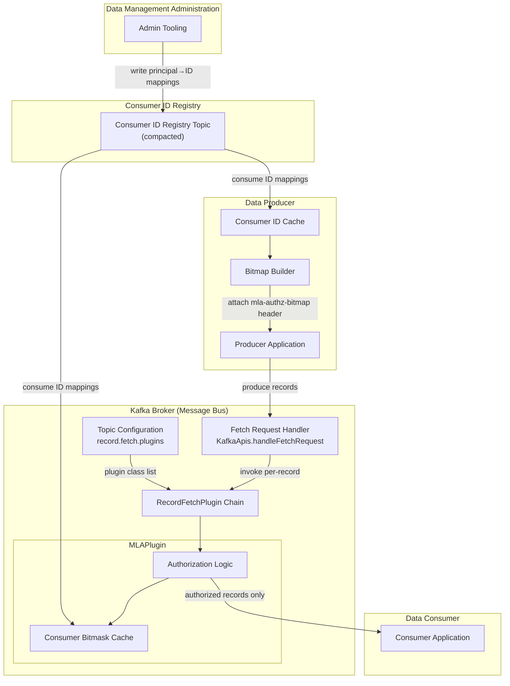
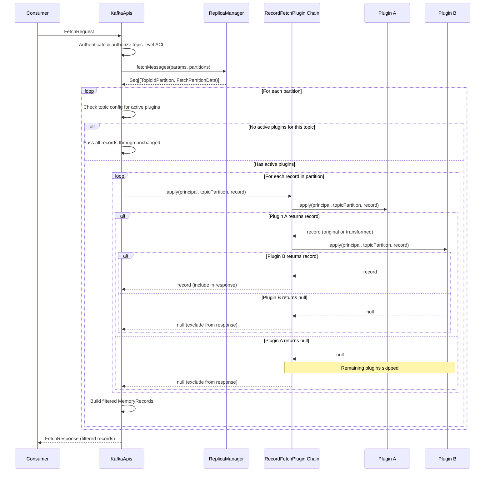
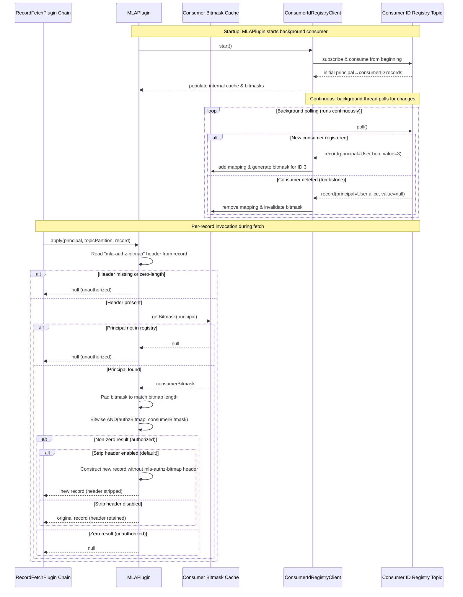

# Design Document: Message-Level Authorization

## Overview

Message-Level Authorization (MLA) extends Apache Kafka's topic-level ACL system with per-record authorization. The design introduces a single new broker-side extension point — the `RecordFetchPlugin` interface — and an MLA plugin implementation that uses bitmap-based authorization to filter records at fetch time.

The system works as follows:

1. **Data Management Administration** creates a compacted Consumer ID Registry topic and assigns auto-incremented integer IDs to Kafka user principals.
2. **Data Producers** read the Consumer ID Registry, construct an authorization bitmap for each record (encoding which consumers may receive it), and attach the bitmap as a record header (`mla-authz-bitmap`).
3. **The Kafka broker** invokes the configured `RecordFetchPlugin` chain during fetch response construction. The `MLAPlugin` performs a bitwise AND between the consumer's bitmask and the record's authorization bitmap. A non-zero result means the consumer is authorized; zero or missing header means the record is excluded.

The only change to the Kafka broker core is the `RecordFetchPlugin` interface and its invocation in the fetch path. All MLA-specific logic lives in the plugin implementation.

### Key Design Decisions

- **Plugin interface, not core change**: The `RecordFetchPlugin` is a general-purpose interface. MLA is one implementation. This keeps the broker extensible without coupling it to authorization logic.
- **Big-endian bit order**: The authorization bitmap uses big-endian bit order (bit 0 = MSB of first byte) for consistent cross-language interpretation.
- **Variable-length bitmaps with short-bitmap tolerance**: Bitmaps are variable-length byte arrays. When a consumer's ID exceeds the bitmap length, the missing bits are treated as 0 (unauthorized).
- **Topic-level plugin activation**: Plugins are loaded at the broker level but activated per-topic via topic configuration, so non-MLA topics incur zero per-record overhead.
- **Header stripping by default**: The MLA plugin strips the authorization header from delivered records by default, preventing consumers from inspecting authorization policies.

## Architecture



### Fetch Path Integration — RecordFetchPlugin Interface

The `RecordFetchPlugin` chain is invoked in the fetch response construction path, after records are read from the log and before they are serialized into the `FetchResponse`. The integration point is in the `processResponseCallback` within `KafkaApis.handleFetchRequest`, where `FetchPartitionData` is converted to `FetchResponseData.PartitionData`.

This diagram shows the generic plugin interface behavior, independent of any specific plugin implementation:



### MLA Plugin Authorization Workflow

This diagram shows how the MLAPlugin specifically uses the `RecordFetchPlugin` interface to perform bitmap-based message-level authorization:



## Components and Interfaces

### 1. RecordFetchPlugin Interface

```java
package org.apache.kafka.server.record;

import org.apache.kafka.common.Configurable;
import org.apache.kafka.common.TopicPartition;
import org.apache.kafka.common.record.internal.Record;
import org.apache.kafka.common.security.auth.KafkaPrincipal;
import org.apache.kafka.server.authorizer.Authorizer;

import java.io.Closeable;
import java.util.Map;

/**
 * A broker-side plugin interface for intercepting records during fetch
 * response construction. Plugins can inspect, transform, or filter
 * individual records before they are delivered to consumers.
 *
 * Lifecycle:
 * 1. Instantiated via no-arg constructor at broker startup.
 * 2. configure(Map) called with broker configuration.
 * 3. start(Authorizer) called with the broker's authorizer instance.
 * 4. isActiveForTopic(String) called to determine per-topic activation.
 * 5. apply() called for each record during fetch on active topics.
 * 6. close() called at broker shutdown.
 */
public interface RecordFetchPlugin extends Configurable, Closeable {

    /**
     * Called after configure() to provide the broker's Authorizer instance.
     * Plugins that need ACL information for extensibility can use this reference.
     *
     * @param authorizer the broker's configured Authorizer, or null if none is configured
     */
    void start(Authorizer authorizer);

    /**
     * Determines whether this plugin is active for the given topic.
     * The plugin should check the topic's configuration (passed via
     * configure or a separate mechanism) to decide.
     *
     * @param topic the topic name
     * @param topicConfig the topic's configuration properties
     * @return true if this plugin should process records for this topic
     */
    boolean isActiveForTopic(String topic, Map<String, String> topicConfig);

    /**
     * Process a single record during fetch response construction.
     *
     * @param principal the authenticated consumer principal
     * @param topicPartition the topic-partition being fetched
     * @param record a read-only reference to the record
     * @return the record to include in the response (original or newly
     *         constructed), or null to exclude the record
     */
    Record apply(KafkaPrincipal principal, TopicPartition topicPartition, Record record);
}
```

### 2. MLAPlugin Implementation

```java
package org.apache.kafka.server.record.mla;

/**
 * Message-Level Authorization plugin implementation.
 * Filters records based on authorization bitmaps in record headers.
 */
public class MLAPlugin implements RecordFetchPlugin {

    // Configuration keys
    public static final String MLA_AUTHZ_HEADER_KEY = "mla-authz-bitmap";
    public static final String STRIP_HEADER_CONFIG = "mla.strip.authorization.header";
    public static final boolean STRIP_HEADER_DEFAULT = true;
    public static final String CONSUMER_ID_REGISTRY_TOPIC_CONFIG = "mla.consumer.id.registry.topic";
    public static final String CONSUMER_ID_REGISTRY_TOPIC_DEFAULT = "_consumer_id_registry";

    // State
    private boolean stripHeader;
    private String registryTopic;
    private ConcurrentMap<String, Integer> principalToConsumerId;
    private ConcurrentMap<String, byte[]> bitmaskCache;

    void configure(Map<String, ?> configs);
    void start(Authorizer authorizer);
    boolean isActiveForTopic(String topic, Map<String, String> topicConfig);
    Record apply(KafkaPrincipal principal, TopicPartition topicPartition, Record record);
    void close();
}
```

### 3. Topic Configuration Extension

A new topic-level configuration property:

| Property | Type | Default | Description |
|---|---|---|---|
| `record.fetch.plugins` | String (comma-separated) | `""` (empty) | Comma-separated list of `RecordFetchPlugin` class names active for this topic. Each class must be loaded at the broker. |

This property is added to `TopicConfig.java` and `LogConfig.java` following the existing pattern:

```java
// In TopicConfig.java
public static final String RECORD_FETCH_PLUGINS_CONFIG = "record.fetch.plugins";
public static final String RECORD_FETCH_PLUGINS_DOC = 
    "A comma-separated list of RecordFetchPlugin class names that are active for this topic. "
    + "Each class must be loaded at the broker via the broker-level record.fetch.plugin.classes "
    + "configuration. If empty, no per-record plugin processing occurs during fetch.";
```

### 4. Broker Configuration Extension

A new broker-level configuration property:

| Property | Type | Default | Description |
|---|---|---|---|
| `record.fetch.plugin.classes` | String (comma-separated) | `""` (empty) | Comma-separated list of `RecordFetchPlugin` implementation class names to load at broker startup. |

### 5. Authorization Bitmap Utilities

A shared utility class for bitmap operations used by both the Data Producer SDK and the MLAPlugin:

```java
package org.apache.kafka.common.security.mla;

/**
 * Utility class for constructing and evaluating authorization bitmaps.
 * Uses big-endian bit order: bit position 0 = MSB of byte[0].
 */
public class AuthorizationBitmap {

    /**
     * Create a bitmap with the specified consumer IDs authorized.
     * @param authorizedIds the set of consumer IDs to authorize
     * @return the bitmap as a variable-length byte array
     */
    public static byte[] create(Set<Integer> authorizedIds);

    /**
     * Create a single-consumer bitmask for the given consumer ID.
     * @param consumerId the consumer's ID
     * @return a byte array with only the bit at consumerId set to 1
     */
    public static byte[] createBitmask(int consumerId);

    /**
     * Check if a consumer is authorized by performing bitwise AND.
     * @param authorizationBitmap the record's authorization bitmap
     * @param consumerBitmask the consumer's bitmask
     * @return true if the bitwise AND result is non-zero
     */
    public static boolean isAuthorized(byte[] authorizationBitmap, byte[] consumerBitmask);

    /**
     * Set a specific bit in a bitmap (big-endian bit order).
     * @param bitmap the bitmap byte array (modified in place)
     * @param bitPosition the bit position to set (0-based)
     */
    public static void setBit(byte[] bitmap, int bitPosition);

    /**
     * Get the value of a specific bit in a bitmap (big-endian bit order).
     * @param bitmap the bitmap byte array
     * @param bitPosition the bit position to read (0-based)
     * @return true if the bit is set
     */
    public static boolean getBit(byte[] bitmap, int bitPosition);

    /**
     * Compute the minimum byte array length needed to represent
     * a bitmap with the given maximum consumer ID.
     * @param maxConsumerId the highest consumer ID to represent
     * @return the required byte array length
     */
    public static int requiredBytes(int maxConsumerId);
}
```

### 6. Consumer ID Registry Client

A client library for reading the Consumer ID Registry topic:

```java
package org.apache.kafka.common.security.mla;

/**
 * Reads and caches consumer ID mappings from the Consumer ID Registry topic.
 * Used by both the MLAPlugin (broker-side) and Data Producers (client-side).
 */
public class ConsumerIdRegistryClient implements Closeable {

    /**
     * @param bootstrapServers Kafka bootstrap servers
     * @param registryTopic the Consumer ID Registry topic name
     */
    public ConsumerIdRegistryClient(String bootstrapServers, String registryTopic);

    /** Start consuming the registry topic in a background thread. */
    public void start();

    /** Get the consumer ID for a principal, or null if not registered. */
    public Integer getConsumerId(String principal);

    /** Get all current principal-to-ID mappings. */
    public Map<String, Integer> getAllMappings();

    /** Close the background consumer and release resources. */
    public void close();
}
```

## Data Models

### Authorization Bitmap Format

The authorization bitmap is a variable-length byte array using **big-endian bit order**:

```
Byte index:    [0]        [1]        [2]       ...
Bit positions: 0 1 2 3    8 9 10 11  16 17 18 19
               4 5 6 7    12 13 14 15 20 21 22 23
```

- **Bit position 0** = most significant bit (MSB) of byte 0 (mask `0x80`)
- **Bit position 7** = least significant bit (LSB) of byte 0 (mask `0x01`)
- **Bit position N** is in byte `N / 8` at mask `0x80 >>> (N % 8)`

**Example**: Authorizing consumer IDs 2 and 5:
- Bit 2 → byte 0, mask `0x80 >>> 2` = `0x20`
- Bit 5 → byte 0, mask `0x80 >>> 5` = `0x04`
- Result: `byte[]{0x24}` = `0b00100100`

**Example**: Authorizing consumer ID 0 only:
- Bit 0 → byte 0, mask `0x80`
- Result: `byte[]{(byte) 0x80}` = `0b10000000`

### Consumer ID Registry Record Format

The Consumer ID Registry is a standard Kafka compacted topic:

| Field | Type | Description |
|---|---|---|
| Key | String (UTF-8) | Kafka user principal (e.g., `User:alice`) |
| Value | 4-byte big-endian int, or null | Consumer ID (auto-incremented from 0), or null for tombstone |

### Record Header

| Header Key | Value Type | Description |
|---|---|---|
| `mla-authz-bitmap` | `byte[]` | Authorization bitmap. Zero-length or missing = unauthorized for all. |

### Consumer Bitmask

Generated by the MLAPlugin at runtime. A byte array with exactly one bit set — the bit at the consumer's ID position. Padded to match the authorization bitmap length during evaluation.

**Example**: Consumer ID 5 → `byte[]{0x04}` = `0b00000100`

### Authorization Check

```
result = authorizationBitmap & consumerBitmask (bitwise AND, byte-by-byte)
authorized = (result != all-zeros)
```

When the authorization bitmap is shorter than the consumer bitmask, the missing bytes are treated as `0x00`. This means consumers with IDs beyond the bitmap length are always unauthorized.


## Correctness Properties

*A property is a characteristic or behavior that should hold true across all valid executions of a system — essentially, a formal statement about what the system should do. Properties serve as the bridge between human-readable specifications and machine-verifiable correctness guarantees.*

### Property 1: Consumer ID Assignment is Sequential and Unique

*For any* sequence of N user principal registrations (with no deletions), the Data Management Administration SHALL assign Consumer IDs as the integers 0, 1, 2, ..., N-1, with each ID assigned to exactly one principal.

**Validates: Requirements 3.3, 3.4**

### Property 2: Retired Consumer IDs Are Never Reassigned

*For any* sequence of user registration and deletion operations, if a user with Consumer ID X is deleted and subsequently new users are registered, none of the newly assigned Consumer IDs SHALL equal X.

**Validates: Requirements 3.6**

### Property 3: Authorization Bitmap Construction Round-Trip

*For any* set of non-negative consumer IDs, constructing an authorization bitmap and then reading back each bit position SHALL return 1 for every ID in the authorized set and 0 for every ID not in the set. The bitmap SHALL use big-endian bit order (bit 0 = MSB of byte 0) and SHALL have a byte length of `ceil((maxId + 1) / 8)`.

**Validates: Requirements 5.1, 5.2, 5.5, 10.1**

### Property 4: Consumer Bitmask Has Exactly One Bit Set

*For any* valid consumer ID N, the generated consumer bitmask SHALL be a byte array with exactly one bit set to 1 at position N (big-endian bit order), and all other bits set to 0.

**Validates: Requirements 6.2**

### Property 5: Authorization Check Correctness

*For any* authorization bitmap B and consumer bitmask M, the authorization check SHALL return `authorized` if and only if the bitwise AND of B and M (byte-by-byte, with the shorter array zero-padded) produces a non-zero result. When the authorization bitmap is shorter than the consumer bitmask, the missing bytes SHALL be treated as 0x00, resulting in `unauthorized` for consumers whose ID exceeds the bitmap's bit capacity.

**Validates: Requirements 7.2, 7.5, 10.4**

### Property 6: Header Stripping Preserves Record Data

*For any* record that passes the authorization check when header stripping is enabled, the returned record SHALL have the same offset, timestamp, key, and value as the original record, SHALL contain all original headers except the `mla-authz-bitmap` header, and SHALL NOT contain the `mla-authz-bitmap` header.

**Validates: Requirements 7.3**

### Property 7: Producer-Plugin Bitmap Agreement (Round-Trip)

*For any* set of authorized consumer IDs and *for any* consumer ID C, constructing an authorization bitmap using the producer's bitmap utility and evaluating it using the plugin's authorization check with a bitmask for consumer C SHALL return `authorized` if and only if C is in the authorized set.

**Validates: Requirements 10.2**

## Error Handling

### Plugin Loading Errors

| Error Condition | Behavior | Error Code/Message |
|---|---|---|
| Plugin class not found on classpath | Broker fails to start with descriptive error | `ClassNotFoundException` logged at ERROR level |
| Plugin class does not implement `RecordFetchPlugin` | Broker fails to start | `ClassCastException` with message identifying the class |
| Plugin `configure()` throws exception | Broker fails to start | Original exception propagated with plugin class name context |
| Plugin `start()` throws exception | Broker fails to start | Original exception propagated |

### Topic Configuration Errors

| Error Condition | Behavior | Error Code/Message |
|---|---|---|
| Topic config references unloaded plugin class | Topic creation rejected | `InvalidConfigurationException`: "RecordFetchPlugin class '{className}' is not loaded at the broker" |
| Topic config has malformed plugin list | Topic creation rejected | `InvalidConfigurationException` with parsing details |

### Fetch-Time Errors

| Error Condition | Behavior | Impact |
|---|---|---|
| Plugin `apply()` throws exception | Log error, exclude the record from response | Record treated as filtered; consumer advances past it |
| Authorization bitmap header has zero-length value | Record excluded (unauthorized for all) | Per Requirement 10.3 |
| Authorization bitmap header missing on MLA topic | Record excluded | Per Requirement 7.6 |
| Consumer principal not found in Consumer ID Registry | Record excluded (no bitmask can be generated) | Consumer receives no records until registered |
| Consumer ID Registry topic unavailable | MLAPlugin logs warning, denies all records | Fail-closed: no authorization data means no access |

### Consumer ID Registry Errors

| Error Condition | Behavior | Impact |
|---|---|---|
| Registry topic does not exist | MLAPlugin fails to start | Broker startup fails if MLA plugin is configured |
| Registry consumer falls behind | Stale cache used | New consumers may be temporarily denied; eventually consistent |
| Duplicate Consumer ID detected | Admin tooling rejects the write | Enforced by the Data Management Administration |

## Testing Strategy

### Test-Only Components

The following components are **external** by design (not part of the Kafka broker) but are implemented as test-only utilities to validate the end-to-end MLA workflow. They live under `src/test/` and are not included in production builds.

#### TestAdminClient (Data Management Administration)

```java
package org.apache.kafka.server.record.mla.test;

/**
 * Test-only implementation of the Data Management Administration role.
 * Manages the Consumer ID Registry topic for integration testing.
 */
public class TestAdminClient implements Closeable {

    /** Create the Consumer ID Registry topic as a compacted topic. */
    public void createRegistryTopic(String topicName, int partitions);

    /** Register a user principal and assign the next auto-incremented Consumer ID. */
    public int registerConsumer(String principal);

    /** Delete a user by writing a tombstone to the registry topic. */
    public void deleteConsumer(String principal);

    /** Get the next Consumer ID that would be assigned (for assertions). */
    public int getNextConsumerId();

    /** Get the set of retired (deleted) Consumer IDs (for assertions). */
    public Set<Integer> getRetiredIds();
}
```

This component encapsulates the ID assignment logic (sequential, never-reuse) and is the target for P1 and P2 property-based tests.

#### TestDataProducer (Data Producer)

```java
package org.apache.kafka.server.record.mla.test;

/**
 * Test-only Data Producer that reads consumer IDs from the registry,
 * constructs authorization bitmaps, and produces records to Kafka.
 *
 * Internally wraps a KafkaProducer and a ConsumerIdRegistryClient.
 */
public class TestDataProducer implements Closeable {

    private final KafkaProducer<String, String> producer;
    private final ConsumerIdRegistryClient registryClient;

    /**
     * @param bootstrapServers Kafka bootstrap servers
     * @param registryTopic the Consumer ID Registry topic name
     */
    public TestDataProducer(String bootstrapServers, String registryTopic);

    /**
     * Produce a record with an authorization bitmap header.
     *
     * Steps:
     * 1. Resolve each principal in authorizedPrincipals to a Consumer ID
     *    via the ConsumerIdRegistryClient.
     * 2. Build the authorization bitmap using AuthorizationBitmap.create()
     *    with the resolved Consumer IDs.
     * 3. Construct a ProducerRecord with the key, value, and an
     *    "mla-authz-bitmap" header containing the bitmap bytes.
     * 4. Send the record via the internal KafkaProducer and return metadata.
     *
     * @throws IllegalArgumentException if any principal is not found in the registry
     */
    public RecordMetadata produce(String topic, String key, String value,
                                  Set<String> authorizedPrincipals);

    /** Refresh the local consumer ID cache from the registry topic. */
    public void refreshConsumerIds();

    /** Close the internal KafkaProducer and ConsumerIdRegistryClient. */
    public void close();
}
```

#### TestDataConsumer (Data Consumer)

```java
package org.apache.kafka.server.record.mla.test;

/**
 * Test-only Data Consumer that subscribes to a topic and collects
 * received records for assertion.
 */
public class TestDataConsumer implements Closeable {

    /** Subscribe to a topic as the given principal. */
    public void subscribe(String topic);

    /** Poll for records and return them. */
    public List<ConsumerRecord<String, String>> poll(Duration timeout);

    /** Get the principal this consumer is authenticated as. */
    public String getPrincipal();
}
```

### Unit Tests

Unit tests cover specific examples, edge cases, and component behavior:

- **AuthorizationBitmap utility**: Concrete examples (IDs {2,5} → `0x24`, ID {0} → `0x80`), zero-length bitmap, single-bit bitmask generation, padding behavior.
- **Plugin chain execution**: Chain ordering with 2-3 plugins, null short-circuit behavior, principal passthrough.
- **Topic configuration validation**: Valid plugin list, empty list, invalid class name rejection.
- **MLAPlugin.apply()**: Authorized record with strip enabled/disabled, unauthorized record, missing header, zero-length header.
- **ConsumerIdRegistryClient**: Cache update on new record, cache removal on tombstone.

### Property-Based Tests

Property-based tests verify universal properties across generated inputs. Each property test runs a minimum of **100 iterations** using [jqwik](https://jqwik.net/) (Java property-based testing library).

Each test is tagged with a comment referencing the design property:

```
// Feature: message-level-authorization, Property 1: Consumer ID Assignment is Sequential and Unique
```

| Property | Generator Strategy | Component Under Test | Assertion |
|---|---|---|---|
| P1: Sequential & unique IDs | Random lists of 1-1000 unique principal strings | TestAdminClient | IDs are 0..N-1, all distinct |
| P2: Retired IDs never reassigned | Random interleaved create/delete sequences (1-500 ops) | TestAdminClient | No deleted ID appears in subsequent assignments |
| P3: Bitmap construction round-trip | Random sets of consumer IDs (0-1000, set size 0-200) | AuthorizationBitmap | `getBit(create(ids), id)` returns true iff `id ∈ ids`; byte length = `ceil((max+1)/8)` |
| P4: Single-bit bitmask | Random consumer IDs (0-1000) | AuthorizationBitmap | Exactly one bit set at position N, popcount = 1 |
| P5: Authorization check | Random bitmaps (1-128 bytes) + random consumer IDs | AuthorizationBitmap | `isAuthorized(bitmap, bitmask(id))` iff bit at position `id` is set in bitmap |
| P6: Header stripping | Random records with 1-10 headers including `mla-authz-bitmap` | MLAPlugin | Stripped record has same key/value/offset/timestamp, all headers except `mla-authz-bitmap` |
| P7: Producer-plugin round-trip | Random authorized ID sets + random query ID | AuthorizationBitmap | `isAuthorized(create(ids), bitmask(queryId))` iff `queryId ∈ ids` |

### Integration Tests

Integration tests use the test-only components (TestAdminClient, TestDataProducer, TestDataConsumer) with an embedded Kafka broker to verify component-level behavior:

- **Plugin loading**: Broker starts with valid plugin config, fails with invalid config.
- **Topic-level activation**: Plugin invoked only for topics with matching `record.fetch.plugins` config.
- **Consumer deletion**: TestAdminClient deletes a consumer → TestDataConsumer for that principal stops receiving new records.
- **Offset advancement**: After filtering, subsequent fetches start after filtered records.
- **High watermark correctness**: HW and LSO are correct in fetch responses regardless of filtering.
- **Consumer ID Registry live updates**: MLAPlugin picks up new consumer registrations and deletions without broker restart.
- **Non-MLA topic passthrough**: Topics without plugins deliver all records with no overhead.

### End-to-End Tests

End-to-end tests validate the complete MLA workflow using an embedded Kafka broker with all test-only components working together. Each scenario is run twice: once with header stripping enabled (default) and once with header stripping disabled.

#### E2E Scenario 1: Selective Authorization with Multiple Consumers

**Setup:**
- TestAdminClient registers 5 consumers: `User:c0` (ID 0), `User:c1` (ID 1), `User:c2` (ID 2), `User:c3` (ID 3), `User:c4` (ID 4)
- TestAdminClient creates an MLA-enabled topic
- 1 TestDataProducer, 5 TestDataConsumers (one per principal), all subscribed to the topic

**Test sequence — the producer sends 4 records:**

| Record | Key | Authorized For | Expected Receivers | Expected Non-Receivers |
|---|---|---|---|---|
| R1 | "only-c0" | {`User:c0`} | c0 | c1, c2, c3, c4 |
| R2 | "c0-and-c2" | {`User:c0`, `User:c2`} | c0, c2 | c1, c3, c4 |
| R3 | "all" | {`User:c0`, `User:c1`, `User:c2`, `User:c3`, `User:c4`} | c0, c1, c2, c3, c4 | (none) |
| R4 | "none" | {} (empty set) | (none) | c0, c1, c2, c3, c4 |

**Assertions:**
- Each consumer receives exactly the records it is authorized for and no others.
- When header stripping is enabled: received records do NOT contain the `mla-authz-bitmap` header.
- When header stripping is disabled: received records DO contain the `mla-authz-bitmap` header with the original bitmap value.
- Record key, value, and all non-authorization headers are preserved in all cases.

#### E2E Scenario 2: Consumer Registration After Record Production

**Setup:**
- TestAdminClient registers 3 consumers: `User:c0`, `User:c1`, `User:c2`
- TestDataProducer produces a record authorized for {`User:c0`, `User:c2`, `User:c5`} (c5 not yet registered)

**Test sequence:**
1. c0 and c2 poll → both receive the record.
2. TestAdminClient registers `User:c5` (assigned ID 5).
3. A new TestDataConsumer for `User:c5` subscribes and seeks to the beginning.
4. c5 polls → receives the record (bitmap already had bit 5 set).

**Assertions:**
- Consumers registered after production can still receive records if the bitmap already authorized their ID.

#### E2E Scenario 3: Consumer Deletion Stops Delivery

**Setup:**
- TestAdminClient registers 3 consumers: `User:c0`, `User:c1`, `User:c2`
- TestDataProducer produces record R1 authorized for {`User:c0`, `User:c1`}

**Test sequence:**
1. c0 and c1 poll → both receive R1.
2. TestAdminClient deletes `User:c1`.
3. Wait for MLAPlugin to pick up the registry update.
4. TestDataProducer produces record R2 authorized for {`User:c0`, `User:c1`} (bitmap still has bit 1 set).
5. c0 polls → receives R2.
6. c1 polls → does NOT receive R2 (principal no longer in registry, no bitmask can be generated).

**Assertions:**
- Deleted consumers stop receiving records even if the authorization bitmap still includes their bit position.

#### E2E Scenario 4: Non-MLA Topic Passthrough

**Setup:**
- TestAdminClient registers 2 consumers: `User:c0`, `User:c1`
- Create a regular topic (no `record.fetch.plugins` configured)
- TestDataProducer produces records to the regular topic (no authorization headers)

**Test sequence:**
1. c0 and c1 poll → both receive all records.

**Assertions:**
- All records are delivered to all consumers without filtering.
- No authorization headers are expected or checked.
